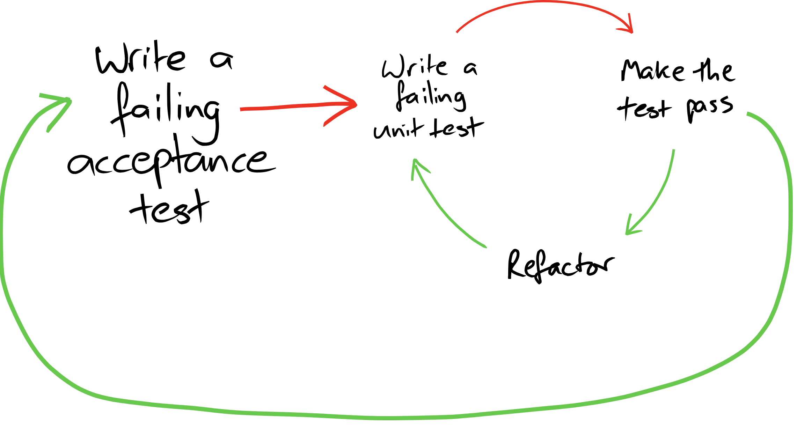

# Url shortener kata

The goals of this kata

1. practice TDD with complex technologies
2. practice outside-in TDD, starting from an e2e acceptance tests.

We will implement a version of the greeter service that will respond over an HTTP connection.  We will use `node`'s native http service.

We want to practice the "double loop" of ATDD:



## Url shortener procedure

- Start the server with `ls *.js | entr -r node server.js`
- Run `./e2e.js`: one test fails
  - first **fix the greeter unit test**
  - then fix the greeter production code
  - then run the `./e2e.js` again and it should pass
- Unskip the next e2e test, and run the e2e again


**Remember to always test things with unit tests -- avoid relying on e2e alone.**

## Installation

```shell
npm install key-file-storage
```

## Starting the server
```shell
node server.js
```

If you want to restart the server every time any file is changed, do

```shell
ls *.js | entr -r node server.js
```

## Executing the end-to-end tests

Start the server, then

```shell
./e2e.js
```


## Detailed script

1. Start the server (see below)
2. Execute the `./e2e.js` file.  Notice that
    - one test passes
    - one test fails
    - two tests are skipped
3. Examine the `e2e.js` file, understand what it does.
    - **Coach**: in outside-in TDD, we start with an end-to-end acceptance test, then we move to unit tests until we think that the e2e test will pass
4. Examine the `server.js` file; understand why the test fails and fix it.
5. Now the `./e2e.js` should pass.  Unskip the next test and see it fail
    - **Coach:** Our goal is to enable us to move as quickly as possible to the level of unit test.  In order to do this, we want to extract the **logic** that returns the "hello, ..." string to a pure function, that does not depend on `node` http technology.
    - Skip the test again so that we go back to green.
6. Move the "hello, world" logic to the `greet_service` function in the `greet_feature.js`. It does not pass the Hello, <name>) test yet.  Make `server.js` use the `greet_service` function.  Check that the `./e2e.js` is still passing.


## Hints with Node built-in http


Responding to a get request
```javascript
http.createServer((req, res) => {
  res.setHeader('Content-Type', 'application/json');
  res.statusCode = 200;
  res.end(JSON.stringify({foo: "bar"}));
})
```

Parsing the query string:
```javascript
http.createServer((req, res) => {
  const parsed_url = new URL(req.url, `http://${hostname}:${port}`);
  const params = Object.fromEntries(parsed_url.searchParams);
  
  // etc.
  res.statusCode = 200;
  res.setHeader('Content-Type', 'application/json');
  res.end(JSON.stringify({foo: "bar"}));
})
```

